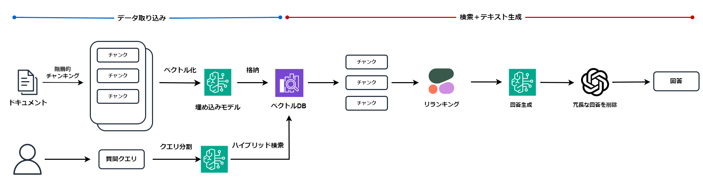

# RAG-1グランプリ
   

## はじめに
本リポジトリは、2024/09/12～2024/10/10の期間にSIGNATEで開催された[RAG-1グランプリ](https://signate.jp/competitions/1407)コンペに参加した際に実際に利用したソースコードを公開しております。
結果は、84位となりブロンズメダルを受賞いたしましたので、自分なりに取り組んだ内容を共有したいと思います。

## 構成
今回のRAGシステムでは、主にAmazon BedrockとLangChainを利用しております。それぞれの利用用途は下記になります。  
* データ取り込み処理および検索処理にAmazon Bedrockの`Knowledge Base`を利用
    * チャンキングやクエリ分割、ハイブリッド検索
* リランカーとしてCohereの`Cohere-rerank-v3-multilingual`を利用
* 回答生成に`Claude3.5 Sonnet`と`GPT-4o`を利用

